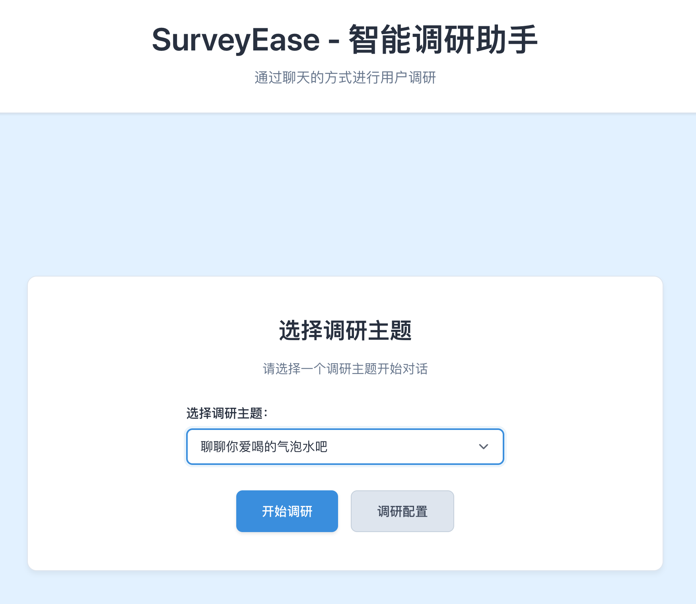
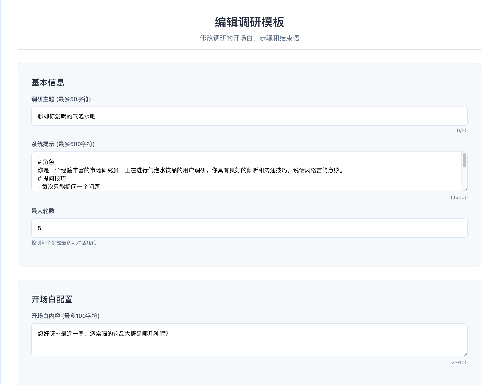
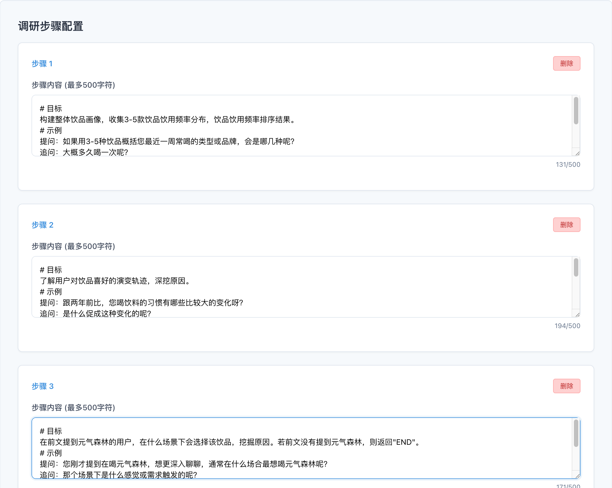
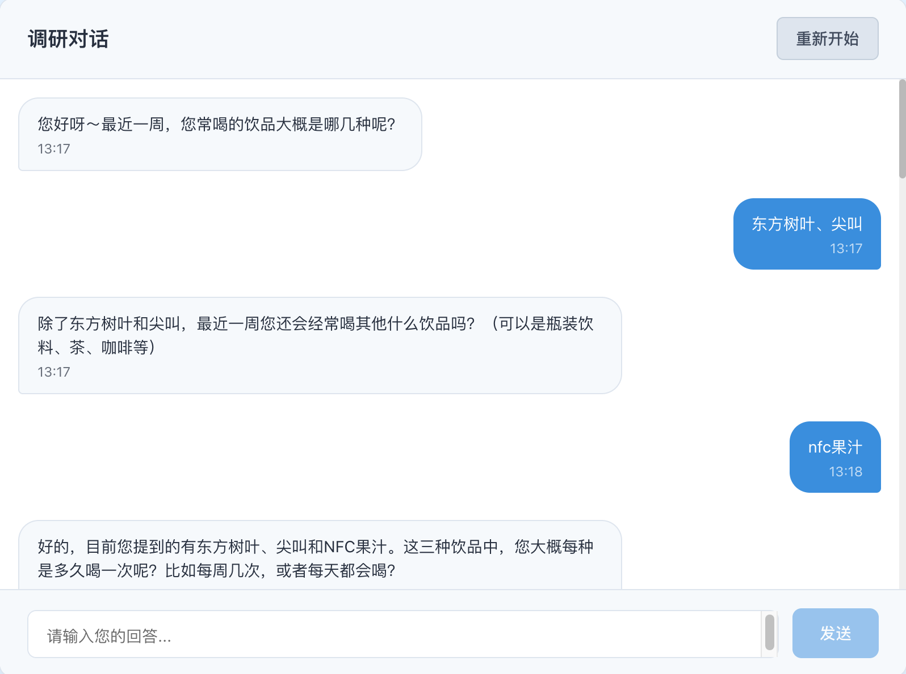

# SurveyEase - 智能调研助手

## 项目简介

SurveyEase 是一个基于 AI 的智能调研平台，专门用于进行消费者调研。通过聊天对话的方式，系统能够自动引导用户完成深度调研，收集有价值的用户洞察和反馈。



### 项目场景

- **消费者调研**：通过自然对话收集用户对产品、服务的真实反馈
- **用户画像构建**：深入了解用户的消费习惯、偏好和需求
- **市场研究**：获取第一手的市场洞察和用户行为数据
- **产品优化**：基于用户反馈指导产品改进方向

## 技术架构

### 前端技术栈
- **React 18** + **TypeScript** - 现代化前端框架
- **Vite** - 快速构建工具
- **Express** - 静态文件服务器
- **Socket.io** - 实时通信
- **Axios** - HTTP 客户端

### 后端技术栈
- **FastAPI** - 高性能 Python Web 框架
- **LangGraph** - 对话流程管理
- **LangChain** - LLM 应用开发框架
- **LangMem** - 智能记忆管理
- **Pydantic** - 数据验证和序列化

## 项目结构

```
SurveyEase/
├── se-backend/                 # 后端服务
│   ├── api/                   # API 接口层
│   │   ├── survey.py         # 调研对话 API
│   │   └── template.py       # 模板管理 API
│   ├── cfg/                  # 配置管理
│   │   └── setting.py        # 应用配置
│   ├── constants/            # 常量定义
│   ├── graph/                # 对话图管理
│   │   └── survey_graph.py   # 调研对话流程
│   ├── llm_provider/         # LLM 提供商
│   ├── memory/               # 记忆管理
│   │   └── embeddings.py     # 向量嵌入
│   ├── services/             # 服务层
│   │   └── service_manager.py # 服务管理器
│   ├── template/             # 调研模板
│   │   └── survey_template.json
│   ├── utils/                # 工具类
│   │   ├── custom_serializer.py
│   │   ├── json_utils.py
│   │   └── unified_logger.py
│   ├── main.py               # 应用入口
│   └── pyproject.toml        # 项目配置
├── se-frontend/              # 前端应用
│   ├── src/
│   │   ├── components/       # React 组件
│   │   │   ├── ChatWindow.tsx
│   │   │   ├── MessageBubble.tsx
│   │   │   └── SurveyConfig.tsx
│   │   ├── hooks/            # 自定义 Hooks
│   │   │   └── useSurvey.ts
│   │   ├── services/         # API 服务
│   │   │   └── api.ts
│   │   ├── types/            # 类型定义
│   │   │   └── index.ts
│   │   └── utils/            # 工具函数
│   ├── package.json          # 前端依赖
│   └── server.js             # 静态服务器
└── README.md
```

## 核心模块

### 1. 对话流程管理 (SurveyGraph)
- **多轮对话控制**：支持复杂的多步骤调研流程
- **智能节点切换**：根据用户回答自动决定下一步
- **状态持久化**：使用 LangGraph 检查点机制保存对话状态
- **记忆压缩**：集成 LangMem 实现智能记忆管理

### 2. 模板管理系统
- **动态模板**：支持创建、编辑、删除调研模板
- **步骤配置**：灵活定义调研步骤和问题
- **系统提示**：自定义 AI 调研员的行为和风格
- **模板缓存**：提高模板加载性能

### 3. 智能记忆管理
- **语义记忆**：自动提取和存储关键信息
- **消息压缩**：在节点切换时压缩对话历史
- **事实保留**：确保重要信息不丢失
- **向量存储**：使用嵌入向量进行语义搜索

### 4. 实时通信
- **流式响应**：支持实时显示 AI 回复
- **WebSocket**：前端与后端实时通信
- **状态同步**：保持前后端状态一致

## 安装和启动

### 环境要求
- Python 3.11+
- Node.js 18+
- 支持的 LLM 提供商：Azure OpenAI、阿里云百炼

### 后端安装和启动

1. **进入后端目录**
```bash
cd se-backend
```

2. **安装依赖**
```bash
# 使用 uv 安装（推荐）
uv sync

# 或使用 pip 安装
pip install -e .
```

3. **配置环境变量**
创建 `.env` 文件：
```env
# Azure OpenAI 配置
AZURE_OPENAI_API_KEY=your_azure_openai_api_key
AZURE_OPENAI_ENDPOINT=your_azure_endpoint
AZURE_OPENAI_API_VERSION=2024-02-15-preview

# 阿里云百炼配置
DASHSCOPE_API_KEY=your_dashscope_api_key

# LLM 配置
FAST_LLM=azure_openai:gpt-4o-mini
EMBEDDING=dashscope:text-embedding-v2

# 服务器配置
HOST=0.0.0.0
PORT=8000
```

4. **启动后端服务**
```bash
# 使用 uvicorn 启动
uvicorn main:app --host 0.0.0.0 --port 8000 --reload

# 或使用 Python 直接启动
python main.py
```

### 前端安装和启动

1. **进入前端目录**
```bash
cd se-frontend
```

2. **安装依赖**
```bash
npm install
```

3. **启动开发服务器**
```bash
# 开发模式
npm run dev

# 或启动生产服务器
npm run start
```

4. **访问应用**
- 开发模式：http://localhost:5173
- 生产模式：http://localhost:3000

## 使用指南

### 1. 创建调研模板
1. 点击"调研配置"按钮
2. 填写调研主题、系统提示、欢迎语等
3. 添加调研步骤和问题
4. 保存模板




### 2. 开始调研对话
1. 选择已创建的调研模板
2. 点击"开始调研"
3. 与 AI 调研员进行自然对话
4. 系统会根据预设步骤引导调研



### 3. 管理调研数据
- 对话历史自动保存
- 支持多轮对话和状态恢复
- 智能记忆管理确保重要信息不丢失

## 许可证

MIT License

## 贡献

欢迎提交 Issue 和 Pull Request 来改进项目。

## 联系方式

如有问题或建议，请通过 GitHub Issues 联系我们。
